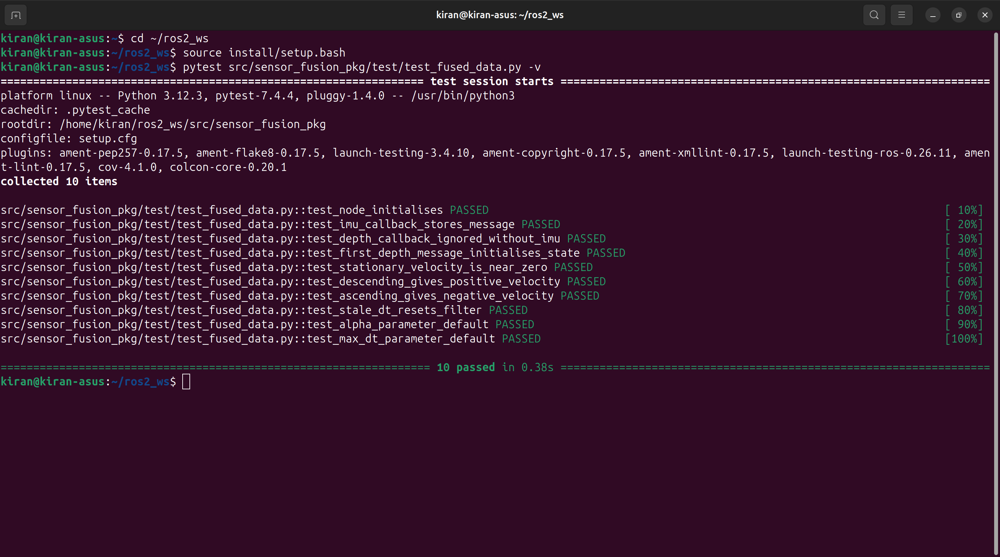
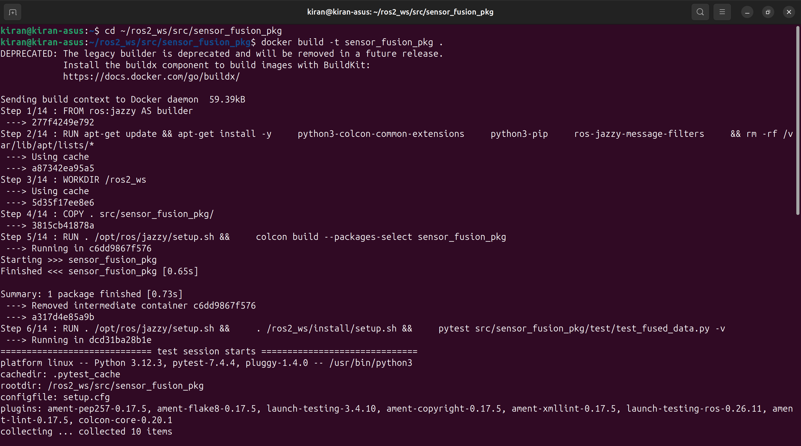
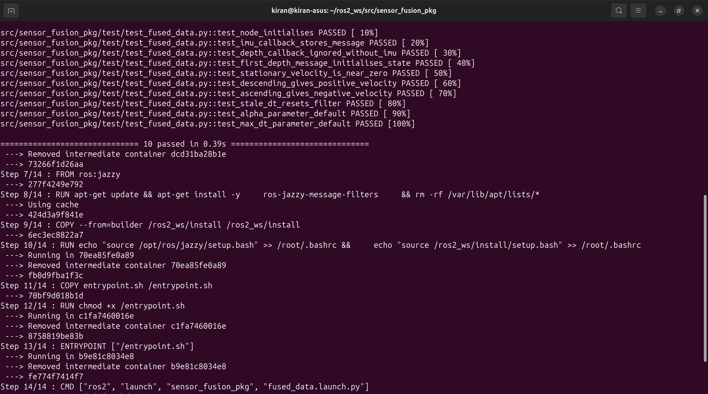
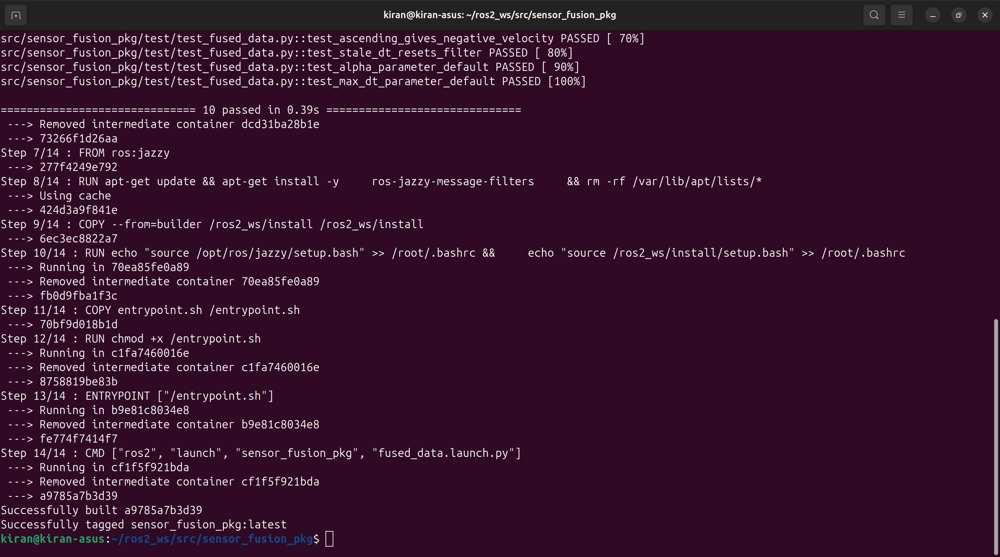

# sensor_fusion_pkg


A ROS2 Jazzy package that estimates vertical velocity by fusing IMU and depth sensor data using a complementary filter.

---

## Basic Overview

Estimating vertical velocity from a single sensor has some limitations:

- **Depth differentiation ONLY** is drift free but noisy at high frequency since small measurement errors get amplified when you divide by a short time step.
- **IMU integration ONLY** is smooth and responsive but gathers drift over time due to the accelerometer's bias.

A complementary filter solves both problems by combining the 'best of both worlds'.

```
v_depth = (depth_now - depth_prev) / dt          # noisy but drift free
v_imu   = v_prev + (a_z - 9.81) * dt             # smooth but drifts
v_fused = alpha * v_imu + (1 - alpha) * v_depth  # best of both worlds
```

The default value of `alpha` is set to `0.98`, so the filter trusts the IMU for any quick response and lets the depth term slowly correct any drift.

---

## Package Structure

```
sensor_fusion_pkg/
├── sensor_fusion_pkg/
│   ├── __init__.py
│   └── fused_data_node.py       # main node
├── launch/
│   └── fused_data.launch.py     # launch file
├── test/
│   └── test_fused_data.py       # unit tests
├── .github/
│   └── workflows/
│       └── ci.yml               # github actions CI
├── resource/
│   └── sensor_fusion_pkg        # ament resource index marker
├── package.xml
├── setup.py
├── setup.cfg
├── CMakeLists.txt
├── Dockerfile
├── entrypoint.sh
└── .dockerignore
```

---

## Topics

| Topic | Type | Direction | Description |
|---|---|---|---|
| `/imu/data` | `sensor_msgs/Imu` | Subscriber | IMU linear acceleration |
| `/depth` | `std_msgs/Float32` | Subscriber | Depth reading in metres |
| `/vertical_velocity` | `std_msgs/Float32` | Publisher | Estimated vertical velocity (m/s) |

Positive velocity values are shown when descending and negative velocity when ascending.

---

## Parameters

| Parameter | Type | Default | Description |
|---|---|---|---|
| `alpha` | float | `0.98` | Complementary filter coefficient. Higher values make the filter trust the IMU more. |
| `max_dt` | float | `1.0` | Maximum allowed time gap between messages (seconds). Larger gaps are treated as sensor data failure and reset the filter. |

---

## Building and Running Locally

### Prerequisites

- ROS2 Jazzy
- Ubuntu 24.04

### Build

```bash
mkdir -p ~/ros2_ws/src
cd ~/ros2_ws/src
git clone <your-repo-url> sensor_fusion_pkg
cd ~/ros2_ws
colcon build --packages-select sensor_fusion_pkg
source install/setup.bash
```

### Run

```bash
ros2 launch sensor_fusion_pkg fused_data.launch.py
```

To override the default values at launch:

```bash
ros2 launch sensor_fusion_pkg fused_data.launch.py alpha:=0.95 max_dt:=0.5
```

### Test

```bash
pytest src/sensor_fusion_pkg/test/test_fused_data.py -v
```

---

## Building and Running with Docker

### Prerequisites

- Docker

### Building the image

```bash
git clone <repo-url> sensor_fusion_pkg
cd sensor_fusion_pkg
docker build -t sensor_fusion_pkg .
```

Unit tests run automatically during the Docker build. If any test fails, the build fails.

### Test Results



Pytest Results shown above.






 

### Run the node

```bash
docker run --rm sensor_fusion_pkg
```

### Run with custom parameters

```bash
docker run --rm sensor_fusion_pkg \
  ros2 launch sensor_fusion_pkg fused_data.launch.py alpha:=0.95
```

---

## CI

This repo uses github actions. On every push and pull request, github automatically builds the docker image and runs the unit tests. Results are shown under the **Actions** tab in the repository.

The workflow is defined in `.github/workflows/ci.yml`.

---

## Some Discussions

**Why a complementary filter and not a Kalman filter?**

A Kalman filter would actually be optimal but we need to tune the noise covariance matrices for different sensors.

A complementary filter will get the same thing done by fusing IMU and depth, with a single parameter (`alpha`) and no sensor specific tuning.

Given that the requirements state that code clarity is more important than the complexity of algorithm, this works better.

**Why two separate callbacks instead of a time synchronizer?**

A `message_filters.ApproximateTimeSynchronizer` would pair messages by timestamp, but it adds unnecessary complexity.

Instead, the IMU callback stores the latest reading and the depth callback triggers fusion using that reading.

The filter computes `dt` from the wall clock time on every update, so it automatically adapts to whatever rate the sensors publish at without hardcoding any frequencies. (I've worked with IMUs and 40Hz is a standard rate)

**Why is `max_dt` a parameter?**

Sensor dropout followed by a sudden large `dt` would cause a very large spike in velocity readings. `max_dt` is sort of a safeguard against this by resetting the filter's state whenever the time gap is too large.

Making it a parameter means it can be tuned at launch time for different sensors without modifying any code.
